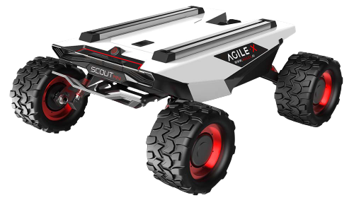

=================
AgileX Scout MINI
=================

The AgileX SCOUT MINI is a compact, four-wheel differential drive mobile robot that can be used in
a wide variety of applications. SCOUT MINI's small chassis, 24V15Ah battery, and strong motors give
it the power to drive at a maximum speed of 10km/h and carry a payload of 10kg over long distances
and up to 50kg for shorter distances. An optional mecanum wheels package allows the SCOUT MINI to
drive omnidirectionally. The robot's high clearance of 115mm and its rocker arm suspension allow it
to climb obstacles 70mm in height and traverse slopes of 30° with a payload. The platform is fitted
with a CAN communication interface, a serial port interface, and top-mounted slide rails for easy
payload integration. Open-source packages are available for C++ and ROS for secondary development.

What's Here
===========

*   :doc:`getting_started` - These guides will walk you through the setup process for your SCOUT
    MINI.
*   :doc:`operation` - These guides will details concepts related to the operation of the SCOUT
    MINI.
*   :doc:`specifications` - Contains specification information for the SCOUT MINI and related
    hardware.

Table of Contents:
==================

.. toctree::
    :maxdepth: 2
    :titlesonly:

    getting_started.rst
    operation.rst
    specifications.rst
