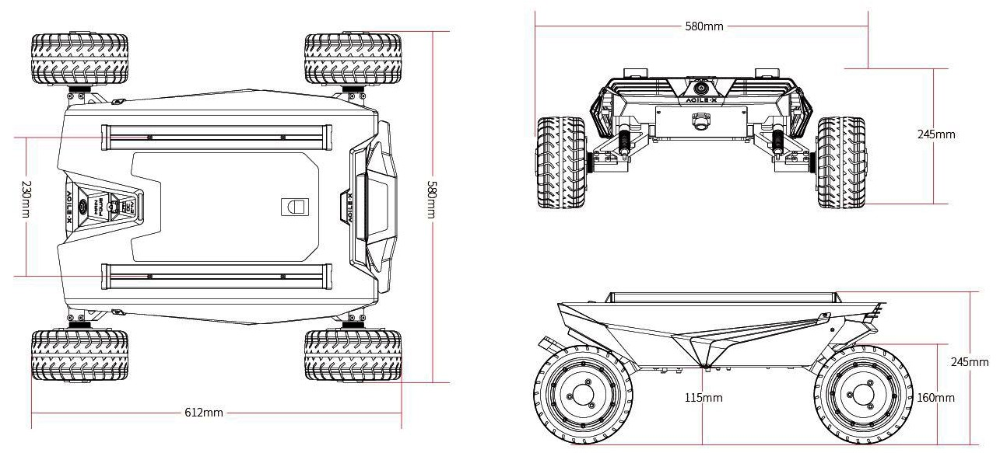

==============
Specifications
==============

.. contents::
    :local:

Bill of Materials
=================

.. tabs::

    .. group-tab:: Standard Wheels

        *   1x SCOUT MINI Robot Body
        *   1x Battery Charger (220VAC)
        *   1x Aviation Plug Male 4-Pin
        *   1x USB-to-CAN Module
        *   1x RC Transmitter
        *   1x USB-to-RS232 Module

    .. group-tab:: Mecanum Wheels

        *   1x SCOUT MINI Omni Robot Body
        *   1x Battery Charger (AC 220V)
        *   1x Aviation Plug Male 4-Pin
        *   1x USB-to-CAN Module
        *   1x RC Transmitter
        *   1x USB-to-RS232 Module

Specifications Overview
=======================

.. tabs::

    .. group-tab:: Standard Wheels

        .. list-table::
            :align: center

            * - Dimensions
              - 612mm x 580mm x 245mm
            * - Weight
              - 26kg
            * - Payload
              - 10kg
            * - Operating Temperature
              - -20°C to 60°C
            * - IP Rating
              - IP22
            * - Battery
              - 24V15Ah
            * - Power Supply Output
              - 24V15A
            * - Range (No Load)
              - 10km
            * - Communication
              - CAN and Serial Interfaces
            * - Maximum Speed (No Load)
              - 2.7m/s
            * - Maximum Climbable Obstacle Height (No Load)
              - 70mm
            * - Maximum Climbable Slope (No Load)
              - 30°
            * - Minimum Ground Clearance
              - 115mm
            * - Motors
              - Four 150W Brushless Motors

    .. group-tab:: Mecanum Wheels

        .. list-table::
            :align: center

            * - Dimensions
              - 612mm x 580mm x 245mm
            * - Weight
              - 26kg
            * - Payload
              - 20kg
            * - Operating Temperature
              - -20°C to 60°C
            * - IP Rating
              - IP22
            * - Battery
              - 24V15Ah
            * - Power Supply Output
              - 24V15A
            * - Range (No Load)
              - 10km
            * - Communication
              - CAN and Serial Interfaces
            * - Maximum Speed (No Load)
              - 1.3m/s
            * - Maximum Climbable Obstacle Height (No Load)
              - 70mm
            * - Maximum Climbable Slope (No Load)
              - 30°
            * - Minimum Ground Clearance
              - 115mm
            * - Motors
              - Four 150W Brushless Motors

Major Dimensions
================

